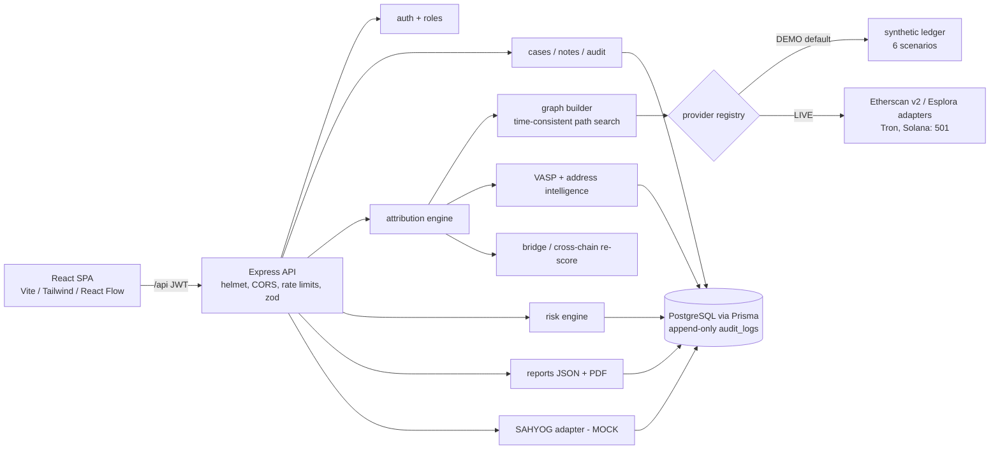

# Architecture

## Request flow: "who is the nearest VASP?"
1. `POST /api/cases/:id/analyze` (auth, heavy rate limit, zod validation).
2. Provider returns normalised transfers (one model for all six chains, decimal-string amounts).
3. `buildGraph` expands outbound up to `maxHops` (cap 6, node cap 5000).
4. `findPaths` enumerates simple, **time-consistent** paths (a hop only uses transfers at/after funds arrived) to addresses the intel layer knows as VASPs.
5. Candidates are scored with weighted, configurable factors (proximity, label quality, path consistency, repeat interactions, hot-wallet relation, temporal consistency, amount share) minus mixer/bridge penalties, normalised to 0-100 and classified Confirmed / Strongly inferred / Probable / Possible / Low. Every factor is returned as evidence with an explanation.
6. Result, evidence and audit entries are stored; the case moves to REVIEW.
7. Risk scoring, report generation and SAHYOG preparation read the stored results.

## Principles
- Attributions are inferences, never identity: the disclaimer is on every result, report and page.
- Providers are swappable behind one interface; DEMO needs no keys; nothing external is faked (SAHYOG is MOCK and labelled so).
- Nothing irreversible happens without investigator action (legal reference required to "submit").
- Every important action is audit-logged in an append-only table.
